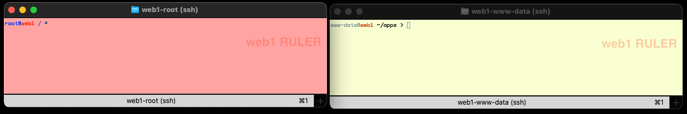
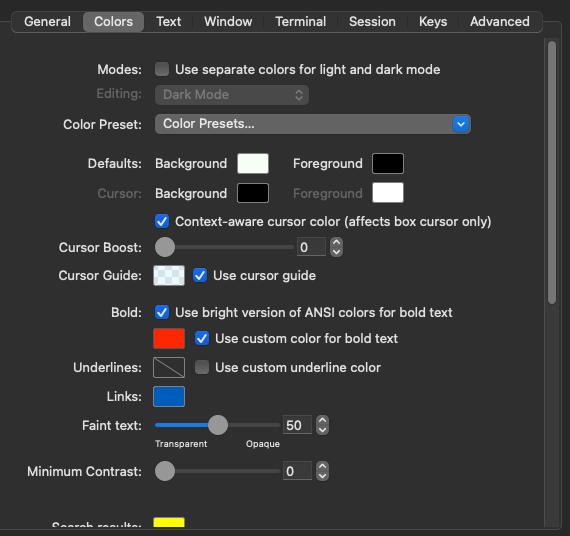
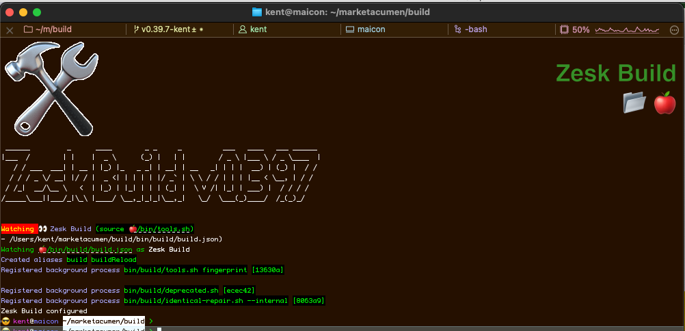
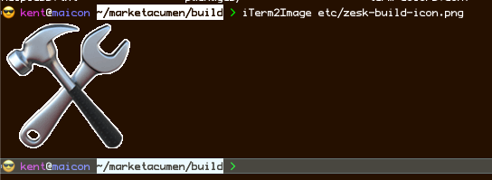
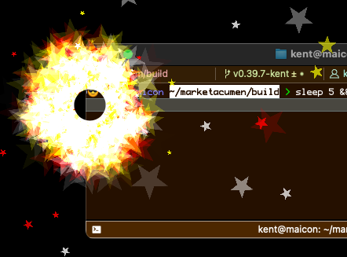

# Learn features of iTerm2 Integration using Zesk Build

(wip 2025-11)

## Just show me the code

### Terminal colors

You need your color scheme which is a simple `name=value` file which is:

- `name` is `decorationName` (run `decorations`) or `iTerm2ColorType` (run `iTerm2ColorTypes`)
- `value` is a RGB hex code in the form `[0-9A-Fa-f]{3,6}`, e.g. `FFF` is white and `000` is black

Create a file (you can use `#` for comments) called `.term-colors.conf` in your project root or `etc/term-colors.conf`
in your project.

Run:

    bashPrompt bashPromptModule_TermColors

To keep your color scheme up to date as you switch projects, and run:

    colorScheme < "etc/term-colors.conf"

(or whatever you name your color scheme) to set the colors.

### Images in the terminal

A PNG file on your system can be output:

    iTerm2Image etc/zesk-build-icon.png

### Get my attention

Flying sparks are just awesome:

    iTerm2Attention !

## iTerm2 Features

iTerm2 is a excellent terminal application for Mac OS X written by George Nachman; I'm a supporter and have been using
his tools for years for my personal development. If you work in the shell much (which I live in) then the Mac OS X
**Terminal** application just does *not* cut it.

I chose it (originally) because it was free (wink) and had command shortcuts to load up profiles, nice color-coded
shells which you could customize, and it was quick and easy to use. I
have [become a monthly sponsor](https://iterm2.com/donate.html) on Patreon since
then and he has added a lot of features.

I have learned a ton about terminal programs and how they work in my development of this toolkit and as part of this;
a lot from this integration work.

> Side note: I am very curious as a developer. Personally I have a strange obsession with needing to understand how
> things work - not in detail but on a macroscopic level I like to understand the gist of what's going on. In this
> case, I was curious how his shell integration worked; so I looked at his shell code which written by
> George for iTerm2. I have learned everything important in my career from someone else's code; and this was no
> different. Here I learned how he (as a terminal program developer) communicates with his terminal from Bash and the
> commands used.

So, as part of this it's best to simply show you how I use **iTerm2** and how these changes have changed how I work.

As a busy cloud developer (wink), I connect to and manage dozens of systems. Anyone who has worked on dozens of systems
knows that entering the wrong command on the wrong system can be **catastrophic** and so it's always important to
provide **context** for a terminal program so you best understand the effects.

For example, here's an example of two terminals for a production system connection vs. a staging system connection in
iTerm2 the way I've set it up. One user has super user access and one does not; notice anything?

In addition to using colors to contextualize my work, I use color schemes to discern project to project so it's clear
when things are related.

The great news is using **Zesk Build** you can set your terminal color schemes using code in your projects or on your
remote systems. And it provides access to all features in **iTerm2**'s shell extensions.

### Wow, the colors

So, iTerm has a lot of *colors* features:

Setting these up ... for each connection, across different customers ... becomes hard to manage.

Great news is that **iTerm2** supports setting these values dynamically from your shell.

So, you can create a file:

    bg=FFF
    fg=000

and pipe it to [`colorScheme`](../tools/colors.md#colorScheme) and the colors take effect immediately.

<!-- new feature -->

As well - cool feature - colors in iTerm2 require a `br_` "bright" version – if you are specifying a new version of one
color it somewhat of a pain to define the bright version of the same color so this is calculated for you automatically
based on color intensity calculations.

Shell direct:

    😎 kent@maicon ~/> cat <<EOF | CI=1 colorScheme --debug
    > blue=00F
    > EOF
    Parsing blue and 00F
    Setting style blue to 38;2;0;0;255
    Reading colors from stdin
    Setting color blue to 00F
    Need colors: 0:br_blue 1:00F [2]
    Filling in missing colors: 0:br_blue 1:00F [2]
    Setting color br_blue to 0000B2
    Filled br_blue with 0.7 00F -> 0000B2
    No background color defined - color mode not set automatically
    😎 kent@maicon ~/marketacumen/build >

> Pro tip: the `CI=1` before `colorScheme` makes `statusMessage` display output with newlines; adding `CI=1` is a
> shortcut to adding them back in.

Now, add in our `bashPrompt` command and when you change projects (or `cd` into a new project home) ... the color scheme
changes automatically!

If you do this within the `Zesk Build` source code:

    bashPrompt --skip-prompt bashPromptModule_TermColors

You'll get the `Zesk Build` color scheme:

Behind the scenes, iTerm2 support is handled by the function `iTerm2SetColors` which behaves similarly to `colorScheme`.

More details can be found:

- `colorScheme --help`
- `iTerm2SetColors --help`
- `bashPrompt --help`
- `statusMessage --help`

## Worth a thousand console lines

Whoa there captain, where did that crazy image come from in the console?

<!-- new feature -->

Again, **iTerm2** has an amazing feature which allows you to render images into the console like output. Handy for
decorating your output, previewing images in a web system, or even looking at pictures on a remote system which is
unshared.

To access images, the format must be `.png`, `.jpeg`, `.gif` or even `.svg` - and yes, it works with animated `gif`s if
you want.

I noticed that rendering of SVG files seems to stop after a certain scale and it then renders a pixelated larger
version:

The magic code:

    iTerm2Image etc/zesk-build-icon.png

[Options](../tools/iterm2.md#iTerm2Image) available to play with:

- `--width columnWidth` - Width in terminal columns to scale the image
- `--height rowHeight` - Height in terminal columns to scale the image
- `--scale` - Skew width and height as given
- `--preserve-aspect-ratio` - Keep the aspect ratio same as the source

You can scale images (and skew them if desired), try `iTerm2Image --help` for more details.

More details can be found:

- [`iTerm2Image --help`](../tools/iterm2.md#iTerm2Image)

## Get my attention

<!-- new feature -->

When doing tasks which take ... like, forever in computer terms (Like minutes, right?) – there's a tendency to work on other things, or even get up and grab a cup of coffee. Point is, at times you *really* want to know when something is completed, or happens – so iTerm has a cool attention feature:

The magic code:

    iTerm2Attention !
    # aka
    iTerm2Attention fireworks

You can also pass in `true` or `false` to activate (deactivate) the Mac OS X dock icon to bounce and demand attention.

### Caveats:

- Note that terminal changes are immediate, but style changes are only when new output is generated by `decorate`.
- Note as well that iTerm2 styles overlap the decoration colors, and so iTerm2 colors take precedence; this means
  redefining `blue` changes the ANSI definition of `blue` in iTerm2, not in the `decorate` styles. 

